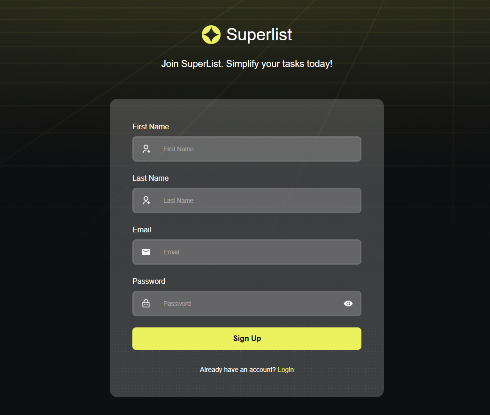
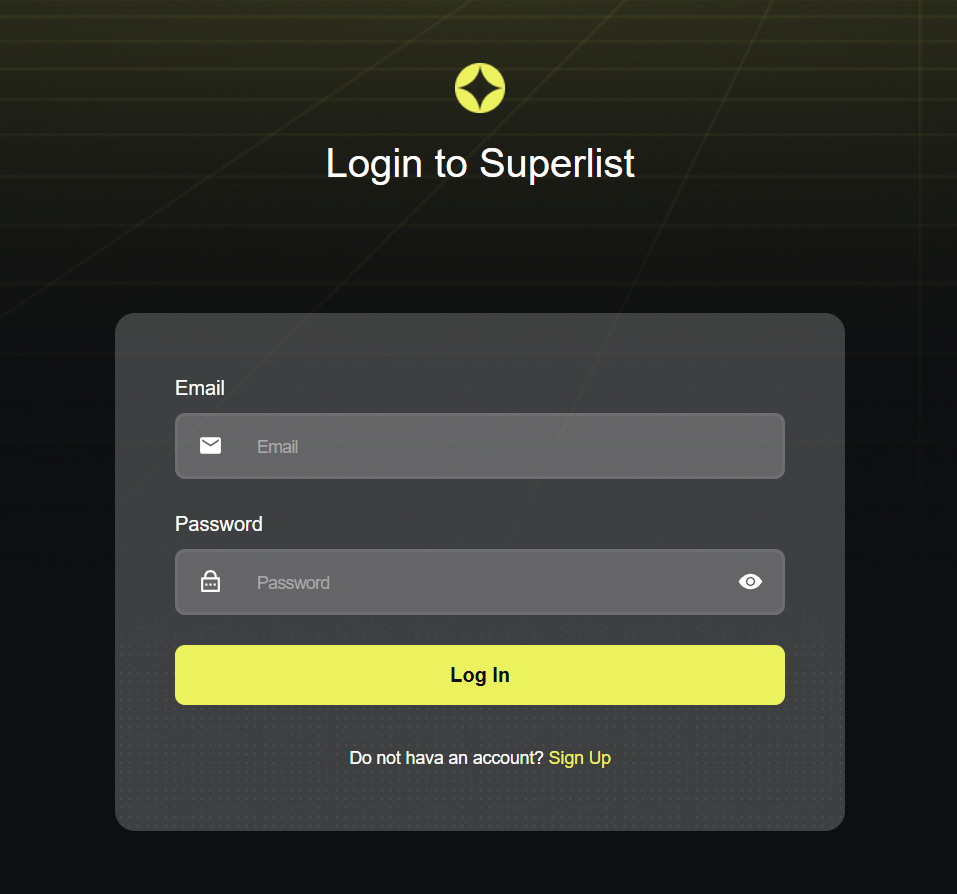
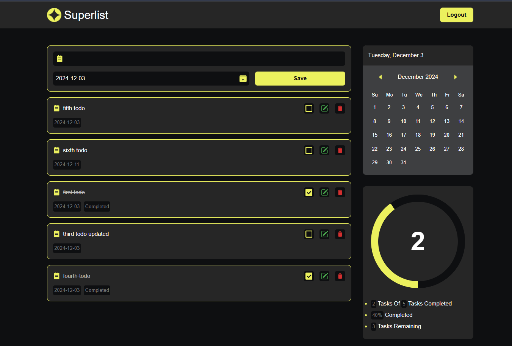
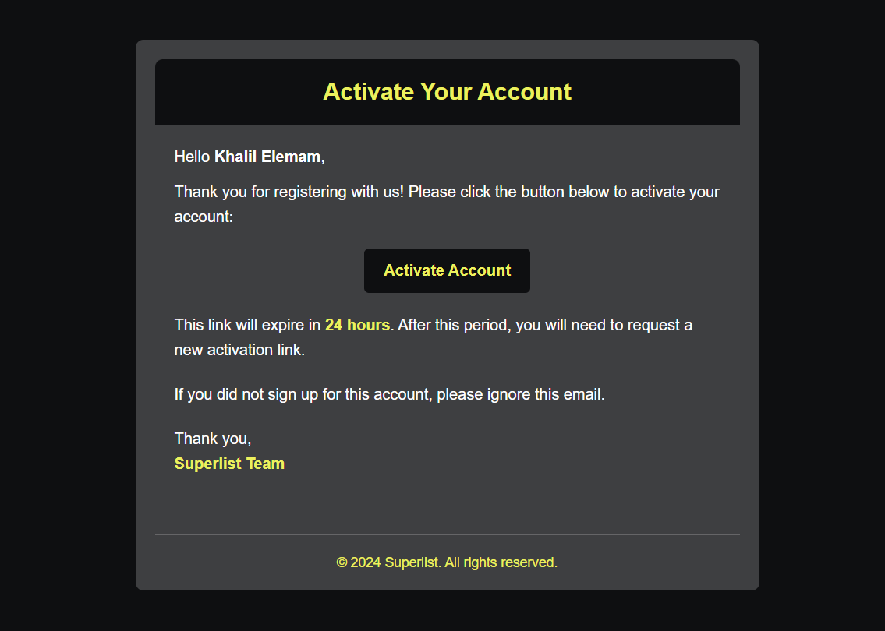

# Superlist - Todo Application 📝

**Superlist** is a sleek and modern Todo application that allows users to manage their tasks efficiently. With features like authentication via JWT, email activation, and a user-friendly interface, this app aims to boost productivity for all users. The design is inspired by modern concepts on **Dribbble** and **Figma**, particularly the [Superlist Web3 Sign-Up Concept](https://dribbble.com/shots/24223501-Superlist-Web3-Sign-Up-Concept).

---

## Screenshots 📸

Take a look at the Superlist Todo Application:

### Signup Page

### Login Page

### Todo Management

### Email Activation

---

## Project Structure

- `todo-ui/`: Frontend code using React and Vite
- `todo-api/`: Backend code using Java and Spring Boot

---

## Features 🚀

- **User Authentication**: Secure login and signup with JWT (Access & Refresh tokens).
- **Email Activation**: Users receive an email to activate their account for added security.
- **Task Management**: Create, update, delete, and manage todos seamlessly.
- **Progress Tracking**: Visual progress bar to track completed tasks dynamically.
- **Modern UI/UX**: A clean and intuitive design inspired by cutting-edge trends on Dribbble and Figma.
- **Error Handling**: Comprehensive feedback to users for smoother interactions.
- **Responsive Design**: Optimized for all devices, ensuring a consistent experience across platforms.

---

## Getting Started

### Prerequisites

- Node.js and npm (for the frontend)
- Java and Maven (for the backend)
- PostgreSQL (for the database)

---

### Setup

For detailed setup instructions, refer to the `README.md` files in the `todo-ui` and `todo-api` directories.

---

### Frontend

Navigate to the [frontend `README.md`](todo-ui/README.md) for setup instructions.

---

### Backend

Navigate to the [backend `README.md`](todo-api/README.md) for setup instructions.

---

## Credits 🙏

- **Inspiration**: The application's design was inspired by [Superlist Web3 Sign-Up Concept](https://dribbble.com/shots/24223501-Superlist-Web3-Sign-Up-Concept) on Dribbble and other Figma design ideas.

---

## Author ✍️

- **Khalil Elemam**  
  Developer of the Superlist Todo Application.  
  Passionate about creating intuitive and efficient software solutions.

Feel free to reach out for feedback or collaboration opportunities!

---

## Contributing

Contributions are welcome! Please fork the repository and submit a pull request with your changes.

---

## License

This project is licensed under the MIT License - see the [LICENSE](LICENSE) file for details.
